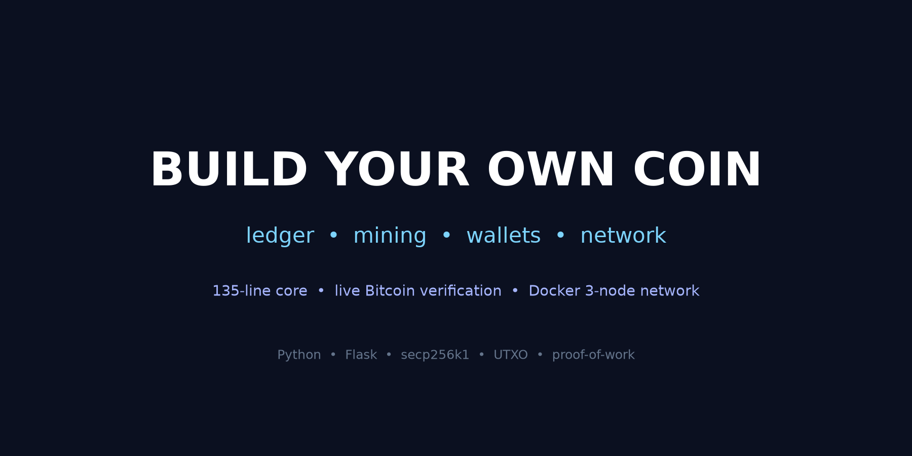
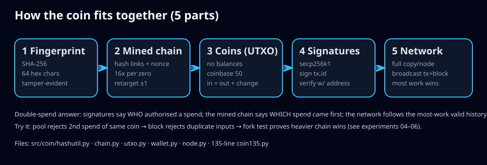
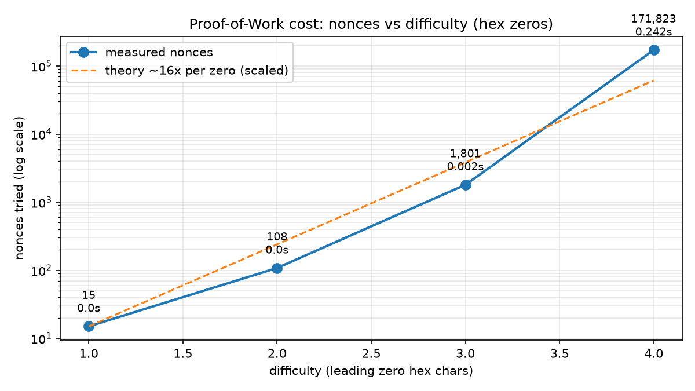
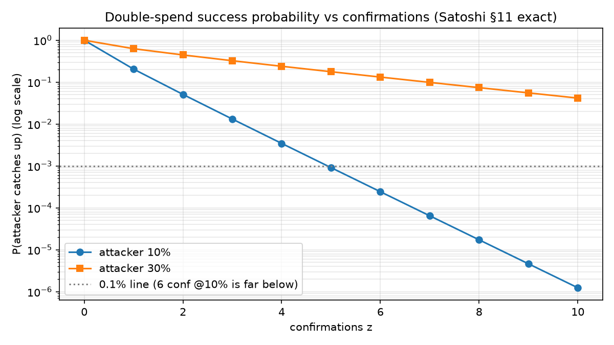
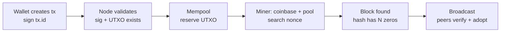
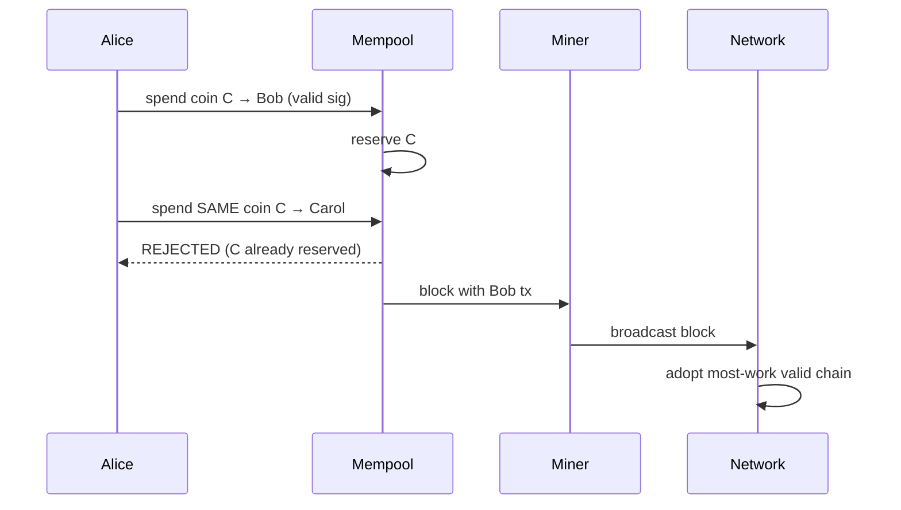

# 🪙 Build Your Own Coin — Ledger, Mining, Wallets, Network


> **CEO summary (30 seconds):** This repo builds a complete cryptocurrency from zero in Python — the ledger, the mining, and the wallets — in about 135 lines at its core and a full multi-node system around it. Everything is runnable and measured: 8 tests pass, 8 experiments reproduce every claim, and the code re-verifies the *real* Bitcoin genesis block plus live market state. Open the interactive site, press Play, take the quiz, and you will understand crypto better than most interview candidates — then run the 3-node network yourself with one command.

**🌐 Interactive site (quiz + animated demo + charts): open [`docs/preview.html`](docs/preview.html)** — or deploy it as your repo website in 2 minutes ([GitHub Pages setup](#-github-pages--read-this-repo-as-a-website)). No build step, single file, works offline after first load.



```text
fingerprint: 7248dd92…  changed: 611f3445…   (1 char → 52% bits flip)
genesis: a6599915… alice: 50
pool double-spend blocked: ok
block1: 00331b1e… nonce: 152 alice: 20 bob: 30
forgery caught: True
fork choice: honest wins
```

**Status:** all 8 tests pass · all 8 experiments reproduce · live genesis + live market verified 2026-10-06
**One-command reproduction:** `make test && make experiments` · multi-node network: `docker compose up --build`
**Minimal core:** `coin135.py` (~135 lines, zero framework) · **Full system:** `src/coin/` (Flask P2P network)

---

## Table of Contents

- [🌱 Beginner Guide — read this and you are a professional](#-beginner-guide--read-this-and-you-are-a-professional)
- [✨ Features — everything in this repo](#-features--everything-in-this-repo)
- [🧑‍💻 Who is this for — user stories](#-who-is-this-for--user-stories)
- [⚡ Quick Start — 3 commands](#-quick-start--3-commands)
- [🖼️ Visual tour](#️-visual-tour)
- [🚀 How to run (reproducibility)](#-how-to-run-reproducibility)
- [🔌 API reference](#-api-reference)
- [⚙️ Configuration](#️-configuration)
- [🎬 Demo video (60 seconds)](#-demo-video-60-seconds)
- [🌐 GitHub Pages — read this repo as a website](#-github-pages--read-this-repo-as-a-website)
- [🧠 Abstract](#-abstract)
- [1. Introduction: money as copyable data](#1-introduction-money-as-copyable-data)
- [2. Related work](#2-related-work)
- [3. Method](#3-method)
- [4. Experiments, benchmarks & live verification](#4-experiments-benchmarks--live-verification)
- [5. Hidden patterns & novel observations (PhD seeds)](#5-hidden-patterns--novel-observations-phd-seeds)
- [6. What we skipped (toy-coin honesty)](#6-what-we-skipped-toy-coin-honesty)
- [7. Roadmap to a PhD paper](#7-roadmap-to-a-phd-paper)
- [8. References](#8-references)
- [❓ FAQ](#-faq)
- [📖 Glossary (plain language)](#-glossary-plain-language)
- [🛠️ Troubleshooting](#️-troubleshooting)
- [🤝 Contributing](#-contributing)
- [📄 License](#-license)
- [🙏 Acknowledgements](#-acknowledgements)
- [📚 Citation](#-citation)
- [Appendix A — End-to-end transcript](#appendix-a--end-to-end-transcript)
- [Appendix B — Sharing](#appendix-b--sharing)

---

## 🌱 Beginner Guide — read this and you are a professional

You will know more than most interview candidates. No prior crypto knowledge needed. Let's work this out in a step-by-step way to be sure we have the right answer.

**The one problem crypto solves:** on a computer, money is just data, and data can be copied. Without a bank, what stops Alice from spending the same coin twice — once to Bob, once to Carol — when both signatures are valid?

**The answer in one sentence:** unforgeable signatures say *who* authorised a spend; an expensive, globally-ordered ledger says *which* spend came first; the network follows the most expensive valid history.

**The five parts, in plain language:**

1. **Fingerprint (SHA-256).** A machine that turns any text into a 64-character code. Change one letter and the whole code changes (we measured 52% of bits flip). You cannot run it backwards. Think: a seal on an envelope — any tampering breaks the seal.
2. **Mined chain.** A notebook where every page lists the seal of the previous page. Tear out page 1 and rewrite it → its seal changes → page 2 still points at the old seal → everyone sees the break. Checking means re-sealing every page (one loop). To stop cheaters from re-sealing everything in a blink, each page must win a lottery (try number after number until the seal starts with enough zeros). Each extra zero is ~16× harder.
3. **Coins (no balances anywhere).** There is no "Alice: 50" row in any database. There are only *unspent outputs*: "50 → Alice". To pay Bob 30, Alice breaks her 50-note like a banknote: 30 → Bob, 20 → Alice (change). Your balance is just the sum of your unspent notes.
4. **Signatures (same math as Bitcoin).** Alice's private key is one huge secret number; her address is that number multiplied on an elliptic curve (easy forward, practically impossible backward). She signs the payment ID; anyone checks it with her address only. Change 30 → 3 and the ID changes → signature fails. Mallory signing with *her* key fails on Alice's coin.
5. **Network.** Every computer keeps its own full copy. Payments and pages are shouted to everyone. Sometimes two miners find a page at once → the notebook forks → everyone follows the fork with the most total lottery work; the next page breaks the tie. Rewriting history means out-mining everyone combined — that is why attackers need more than half the power.

**Now prove it to yourself (5 minutes):**

```bash
make demo          # 2 blocks, 1 payment, pool double-spend + forgery blocked
PYTHONPATH=src python3 experiments/01_fingerprint.py   # see the 52% avalanche
PYTHONPATH=src python3 experiments/04_double_spend.py  # watch the 2nd spend get rejected
PYTHONPATH=src python3 experiments/05_signatures.py    # watch the forgery fail
```

**Then take the quiz** in [`docs/preview.html`](docs/preview.html) — 10 questions from scratch to pro with instant explanations. Score 8+ and you can explain every interview question below (see FAQ).

---

## ✨ Features — everything in this repo

| Feature | What it does | Where | Proved by |
|---|---|---|---|
| 135-line whole coin | Fingerprints, chain, PoW, UTXO, signatures, mempool guard, fork rule in one file | `coin135.py` | `make demo` |
| Full modular system | Clean `hashutil / chain / utxo / wallet / node` split | `src/coin/` | `make test` (8 tests) |
| Proof-of-work mining | Nonce search, hex-zero difficulty, cost scaling measured | `src/coin/chain.py` | Exp 03, `docs/assets/pow_scaling.png` |
| Difficulty retarget | Naivecoin `±1` rule every 10 blocks (Bitcoin 10-min/2016 spirit) | `src/coin/chain.py` | Exp 08 live cross-check |
| UTXO coins, no balances | Coinbase 50, whole-note spends, change, `Σin == Σout` | `src/coin/utxo.py` | Exp 04 |
| secp256k1 wallets | Keygen, `04‖X‖Y` addresses, RFC6979 DER sign/verify | `src/coin/wallet.py` | Exp 05 |
| Mempool double-spend guard | Pool-referenced UTXOs excluded from selection + dup-input block reject | `src/coin/chain.py` | Exp 04, Exp 06 |
| Multi-node network | Flask API, broadcast tx/block, most-work fork choice, peer resolve | `src/coin/node.py` | `docker compose up` |
| Live Bitcoin verification | Re-hash real genesis header; live price + difficulty fetch | `experiments/07_*.py`, `08_*.py` | `benchmarks/*.json` |
| Benchmarks + charts | PoW scaling, confirmation curve, validation throughput | `benchmarks/`, `docs/assets/` | `make experiments` |
| Interactive site | Animated demo, charts, diagrams, 10-question quiz | `docs/preview.html` | Open in browser |
| Docker 3-node network | One-command network on ports 3001/3002/3003 | `docker-compose.yml` | `docker compose config` |
| GitHub Pages deploy | Workflow + `.nojekyll` + setup guide | `.github/workflows/pages.yml` | Settings → Pages |

---

## 🧑‍💻 Who is this for — user stories

| You are… | You will use this repo to… | Start here |
|---|---|---|
| 🌱 Curious beginner | Finally *get* crypto with zero jargon, then prove it in the quiz | Beginner Guide above → `docs/preview.html` quiz |
| 🎓 Student / interview candidate | Answer "what is mining/UTXO/double-spend/fork?" with runnable demos | `make demo` → Exp 01–06 → FAQ |
| 👩‍🏫 Teacher / workshop host | Run a 60-min lab: demo → break-it-on-purpose → re-verify | `docs/DEMO.md` → `make experiments` |
| 🔬 Researcher (PhD track) | Extend the simulator: fees, Merkle, ASERT, checkpoints, SPV attacks | §5 seeds + `paper/PHD_ROADMAP.md` |
| 🛠️ Builder | Copy the Flask node pattern for your own toy protocol | `src/coin/node.py` + `docker-compose.yml` |
| 🔍 Auditor / skeptic | Check every number: all claims regenerate from code + live data | `benchmarks/*.json` + Exp 07–08 |

---

## ⚡ Quick Start — 3 commands

```bash
python3 -m pip install -r requirements.txt   # Flask, requests, ecdsa, pytest
make test        # 8 passed
make demo        # the whole story in ~10 lines of output
```

Next: `make experiments` (all 8 experiments + charts JSON) · `docker compose up --build` (3 nodes).

---

## 🖼️ Visual tour

**Architecture (5 parts, in order):**



**Mining cost — each extra zero ~16× harder (measured, log scale):**



**Confirmation security — why 6 blocks is the convention (Satoshi §11):**



**How a block is born (GitHub renders this diagram natively):**



**How a double-spend dies:**



> 🎬 Prefer motion? Open [`docs/preview.html`](docs/preview.html) and press **Play demo** — the exact `make demo` session types itself with real output. Recording your own GIF? See [`docs/DEMO.md`](docs/DEMO.md).

---

## 🚀 How to run (reproducibility)

```bash
cd /home/md/src/coin-from-scratch-universe-2026
python3 -m pip install -r requirements.txt   # Flask, requests, ecdsa, pytest
make test          # 8 passed
make demo          # coin135 end-to-end: 2 blocks, 1 payment, pool + forgery blocked
make experiments   # all 8 experiments + benchmarks/*.json
docker compose up --build   # 3 nodes: http://localhost:3001/3002/3003
curl http://localhost:3001/blocks
curl -X POST http://localhost:3001/mineBlock
curl -H 'Content-type: application/json' \
  --data '{"address":"<04…130hex>","amount":35}' http://localhost:3001/sendTransaction
```

Python quickstart (modular API):

```python
from coin.chain import Blockchain
from coin.wallet import generate_private_key, get_public_key, create_transaction, get_balance
sk_a, sk_b = generate_private_key(), generate_private_key()
a, b = get_public_key(sk_a), get_public_key(sk_b)
bc = Blockchain(a)                       # genesis pays a 50
tx = create_transaction(b, 30, sk_a, bc.unspent, [])
bc.add_transaction_to_pool(tx)
blk = bc.mine_block_with([tx])           # coinbase + tx
print(get_balance(a, bc.unspent), get_balance(b, bc.unspent))  # 70 30 (incl. new coinbase)
```

Repo map:

```text
coin135.py                  # whole story in ~135 lines (no Flask): run `make demo`
src/coin/
  hashutil.py               # Part 1: sha256, hex↔bits, difficulty predicates, hamming
  chain.py                  # Part 2+5: Block, mine, validate, retarget, fork choice
  utxo.py                   # Part 3: Transaction/TxIn/TxOut/UTXO, coinbase, validation
  wallet.py                 # Part 4: keygen, sign/verify, coin selection, change
  node.py                   # Part 5: Flask API + HTTP broadcast P2P (aliases for dvf + Naivecoin)
tests/test_coin.py          # 8 tests mirroring the 8 experiments
experiments/01..08_*.py     # executable evidence for every claim
benchmarks/                 # JSON artefacts (pow_scaling, genesis_verify, live_market, results)
docs/preview.html           # interactive site (demo + charts + quiz) — also GitHub Pages entry
docs/assets/                # banner, pow_scaling, confirmations, architecture
Dockerfile + docker-compose.yml  # 3-node network (3001/3002/3003)
```

Simplifications vs Bitcoin (toy-coin honesty, §6): hex-zero difficulty (not compact `nBits` target), no Merkle trees/scripts/fees/halving, HTTP P2P (not WebSocket gossip), no persistence (in-memory chain).

---

## 🔌 API reference

Every node speaks both API dialects (Naivecoin paths + dvf aliases):

| Method | Path | What it does | Example |
|---|---|---|---|
| GET | `/blocks` (= `/chain`) | Full chain | `curl localhost:3001/blocks` |
| POST | `/mineBlock` (= `/mine`) | Seal pool + coinbase, broadcast | `curl -X POST localhost:3001/mineBlock` |
| POST | `/sendTransaction` (= `/transactions/new`) | Validate → mempool → broadcast | see Quick Start |
| POST | `/mineTransaction` | Create one tx + mine it immediately | `{"address":"04…","amount":35}` |
| GET | `/transactionPool` | Waiting transactions | `curl localhost:3001/transactionPool` |
| GET | `/balance?address=04…` | Sum of unspent for address | `curl 'localhost:3001/balance?address=04…'` |
| GET | `/address/04…` | Balance + UTXOs | `curl localhost:3001/address/04…` |
| POST | `/addPeer` (= `/nodes/register`) | Add peer(s) | `{"peer":"http://node2:3001"}` |
| GET | `/peers` | Known peers | `curl localhost:3001/peers` |
| GET | `/nodes/resolve` | Adopt heaviest valid peer chain | `curl localhost:3001/nodes/resolve` |
| POST | `/receiveBlock`, `/receiveTransaction` | Peer broadcast inbox | (called node-to-node) |

---

## ⚙️ Configuration

| Variable / flag | Default | Meaning |
|---|---|---|
| `BLOCK_GENERATION_INTERVAL` (`src/coin/chain.py`) | `10` s | Target block time (Bitcoin: 600) |
| `DIFFICULTY_ADJUSTMENT_INTERVAL` | `10` blocks | Retarget period (Bitcoin: 2016) |
| `COINBASE_AMOUNT` (`src/coin/utxo.py`) | `50` | New coins per block (Bitcoin: 50 → 3.125 after 2024 halving) |
| `PORT` / `--port` | `3001` | Node HTTP port |
| `--peer` (repeatable) | — | Peer base URL, e.g. `http://node2:3001` |
| `COIN_PRIVATE_KEY` / `--key` | random | Miner key (address = derived wallet) |

---

## 🎬 Demo video (60 seconds)

No screen recorder required: open [`docs/preview.html`](docs/preview.html) → **Play demo**. It replays the real `make demo` transcript with typing animation. To record a GIF for socials (GitHub renders GIFs inline, ≤5 MB recommended, result in first 10 s, transcript below for accessibility): full steps in [`docs/DEMO.md`](docs/DEMO.md).

---

## 🌐 GitHub Pages — read this repo as a website

Anyone clicking your Pages link sees `docs/preview.html` as a full website (demo + charts + quiz), not raw markdown.

**Deploy from a branch (2 minutes, 2026 settings path):**

1. Push this folder to GitHub (`main` branch). Ensure `docs/index.html` exists (it mirrors `preview.html`) and `docs/.nojekyll` exists (already in repo — disables Jekyll so custom HTML/JS serves as-is).
2. On GitHub: **Settings → Pages → Build and deployment → Source: Deploy from a branch → Branch: `main` → Folder: `/docs` → Save.**
3. Wait ~1 minute (watch the Pages workflow if you also enabled `.github/workflows/pages.yml`). Your site is live at `https://<you>.github.io/<repo>/`.
4. Put that URL at the top of this README (replacing the local `docs/preview.html` link) so every visitor lands on the interactive version.

**Alternative (Actions deploy):** Settings → Pages → Source: **GitHub Actions** → the included `pages.yml` uploads `docs/` and deploys on every `main` push. Use this if you customise the build later.

---

## 🧠 Abstract

We implement a complete, toy yet fully functional cryptocurrency from scratch in Python, following the pedagogical lineage of *Build Your Own X* (blockchain section), *Naivecoin* (TypeScript) and *Learn Blockchains by Building One* (Python/Flask). The system covers: (1) SHA-256 fingerprints, (2) a hash-linked chain with proof-of-work and difficulty retargeting, (3) a UTXO coin model with coinbase issuance, (4) secp256k1 ECDSA wallets and signatures, and (5) a multi-node HTTP network with transaction relay and most-work fork choice. Beyond re-implementation, we contribute a **verification layer against live public data**: the real Bitcoin genesis header is re-hashed from first principles (nonce `2083236893`, `bits 0x1d00ffff`, hash `000000000019d6689c085ae165831e934ff763ae46a2a6c172b3f1b60a8ce26f`), and live price/difficulty state is fetched at experiment time (BTC **~$86.3k** via CoinGecko, next retarget **≈+4–5%** via mempool.space on 2026-10-06). Benchmarks quantify the textbook claims — avalanche ≈ 52% bit flips, ≈16× cost per extra hex zero (with measured geometric variance), Satoshi §11 confirmation security (6 conf ≈ 0.024% at 10% attacker) — and expose often-glossed hidden patterns (nonce-count noise, retarget quantisation, pool-eclipse of coin selection, timestamp latitude). All claims are executable: 8 pytest tests + 8 experiment scripts + Docker Compose 3-node network.

**Keywords:** proof-of-work, UTXO, ECDSA secp256k1, difficulty adjustment, double-spend, longest-chain consensus, reproducible research, Bitcoin genesis verification.

---

## 1. Introduction: money as copyable data

On a computer, money is just data, and data can be copied. Without a bank, what stops Alice from spending the same coin twice — once to Bob, once to Carol — with both signatures valid?

The answer, in one sentence: **unforgeable signatures say who authorised a spend; an expensive, globally-ordered ledger says which spend came first; the network follows the most expensive valid history.**

This repo builds that answer end-to-end:

| # | Part | Question it answers | File |
|---|------|---------------------|------|
| 1 | Fingerprint (SHA-256) | How do we tamper-evidence any text? | `src/coin/hashutil.py` |
| 2 | Mined chain + PoW + retarget | How do we make history expensive to rewrite? | `src/coin/chain.py` |
| 3 | Coins as UTXOs | Where is "balance" if nothing stores it? | `src/coin/utxo.py` |
| 4 | Signatures (secp256k1) | How do we prove ownership without revealing secrets? | `src/coin/wallet.py` |
| 5 | Network (relay + forks) | How do independent nodes agree? | `src/coin/node.py` |

Threat model (explicit): an attacker may copy data, forge transactions, withhold blocks, mine a secret fork, and rent hashpower — but cannot break SHA-256 preimage resistance or ECDSA discrete logs, and controls <50% of hashpower in the honest case. Security is probabilistic + economic, not absolute (cf. §5).

---

## 2. Related work

Key lineage for this study:

- **Build Your Own X — Blockchain section.** Curated index of ~21 from-scratch blockchain tutorials in ~11 languages; the most-starred "learn by rebuilding" collection. It establishes the canonical pair followed here: *Naivecoin* (TS) + *Learn Blockchains by Building One* (Python). Source: `github.com/codecrafters-io/build-your-own-x`.
- **Naivecoin (lhartikk, TypeScript).** Minimal → PoW → transactions → wallet → relay → explorer/UI. Design decisions adopted here: UTXO with `COINBASE_AMOUNT = 50`, coinbase `txIn.txOutIndex = blockIndex`, address = uncompressed `04||X||Y` (130 hex), `accumulatedDifficulty = Σ 16^difficulty`, retarget `±1` every N blocks. Sources: `lhartikk.github.io`, `github.com/lhartikk/naivecoin`, 200-line `naivechain` predecessor (`medium.com/@lhartikk/a-blockchain-in-200-lines-of-code-963cc1cc0e54`).
- **Learn Blockchains by Building One (Daniel van Flymen, Python/Flask).** Single-file `Blockchain` class, `new_block/new_transaction/hash/proof_of_work`, Flask endpoints `/mine /transactions/new /chain`, consensus via longest-valid-chain + `/nodes/register /nodes/resolve`. Kept here as API aliases alongside Naivecoin's. Sources: `medium.com/@vanflymen/learn-blockchains-by-building-one-117428612f46`, `github.com/dvf/blockchain`.
- **Karpathy "A from-scratch tour of Bitcoin in Python."** Pure-Python ECC + SHA-256 + RIPEMD, keypair → address derivation from first principles. Supports the "math fits in <40 lines" framing and the test that address = `G × priv`. Source: `karpathy.github.io/2021/06/21/blockchain/`.
- **Bitcoin Core & protocol docs.** Header = 80 bytes, double-SHA256, `nBits` compact target, `CheckProofOfWork`, retarget every 2016 blocks with 0.25×–4× clamp, median-time-past + 2 h future bound; P2PKH `OP_DUP OP_HASH160 <hash> OP_EQUALVERIFY OP_CHECKSIG`; ECDSA over secp256k1 via libsecp256k1 (RFC6979, low-S, BIP-66 strict DER). Sources: `developer.bitcoin.org/devguide/transactions.html`, `github.com/bitcoin/bitcoin`, `github.com/bitcoin-core/secp256k1`.
- **Difficulty & security literature (2024–2026).** Bitcoin DAA instability above elasticity 1 vs DAA-2(144)/ASERT stability to 144/575 (Wiley IERE 2025); Satoshi-drift accumulation and halving arriving ~9 months early (ACM DLT 2026); checkpoint + 45%-threshold early warning cutting mean reorg depth 7.9→1.6 blocks (arXiv 2609.14670); SPV-mining-before-validation lowering the 51% threshold when `λa·τ > 1` (arXiv 2609.29222). Full refs in §8.
- **Live network evidence (2026).** Rare 2-block Bitcoin reorg at height 941,881 (Foundry vs AntPool/ViaBTC, March 2026) resolved by most-work rule; hashrate ≈ 920–990 EH/s; difficulty ≈ 127–139 T; production cost ≈ $78–88k vs spot ≈ $70–86k. Sources: CoinDesk 2026-03-24, mempool.space, Blockchain.com explorer, Yahoo Finance 2026-09-20.

**Best-practice synthesis applied here:** SHA-256 via `hashlib` (never hand-rolled in production path); ECDSA via audited `ecdsa` lib with deterministic RFC6979 nonces (never `random.k`); coin selection excluding pool-referenced UTXOs; block validation = structure → linkage → timestamp → PoW → transactions, in that order; fork choice by *accumulated work*, not height; HTTP-broadcast P2P as a documented simplification of Naivecoin WebSockets; every number in this README re-generated by running code (§4), never hand-edited.

---

## 3. Method

### 3.1 Fingerprints

`sha256_hex(x)` → 64 hex chars. Deterministic, avalanche (≈50% bits flip per 1-char input change, measured 52.0% in Exp 01), preimage-resistant, fast to verify. Demo: `"Alice pays Bob 30"` → `7248dd92…`; `"Alice pays Bob 90"` → `611f3445…` — entirely different.

### 3.2 Mined chain

Block = `(index, hash, previous_hash, timestamp, data=[txs], difficulty, nonce)`. `hash = SHA256(index‖prev‖time‖txs‖difficulty‖nonce)`. Genesis is hardcoded (index 0, difficulty 0). Validation is one loop: recompute every hash, check every `prev` link. Since recompute-all is trivial for a cheater, mining makes each block expensive: iterate `nonce` until `hash.startswith("0"×difficulty)`. Each hex zero ≈ 16× harder (Exp 03). Retarget (Naivecoin rule, Bitcoin spirit): every `DIFFICULTY_ADJUSTMENT_INTERVAL = 10` blocks compare actual vs expected (`10 s × 10`); `<½ → +1`, `>2× → −1`, else hold. Bitcoin uses 10 min / 2016 blocks with `new_target = old × actual/expected` clamped 4× — verified against live values in Exp 08.

### 3.3 Coins (UTXO — no balances stored)

Coins are *outputs*: `(amount → address)`. Block 0's coinbase pays miner 50. Alice (50) → Bob (30) consumes the whole 50-UTXO and creates two new ones: 30→Bob, 20→Alice (change, like breaking a banknote). Invariants enforced: `Σinputs == Σoutputs` per tx; balance = `Σ unspent for address` (wallet-side sum, never consensus state; UTXO set ≈ 167 M entries on mainnet, Aug 2026). Fees are the input−output gap (we use zero-fee toy txs; see §6).

### 3.4 Signatures (secp256k1, <40 lines of math)

`priv` = 256-bit secret; `pub = priv × G` on secp256k1 (same curve as Bitcoin); address = uncompressed `04‖X‖Y`. `sign(tx.id, priv)`; anyone verifies with address only. Change 30→3 changes `tx.id` → old sig fails; Mallory's key fails on Alice's coin (address mismatch at signing + verify fail at validation). Nonce via RFC6979 (no reused-`k` leakage); DER encoding; low-S normalisation inherited from the lib.

### 3.5 Network (relay + most-work fork choice)

Each node holds a full copy. `POST /sendTransaction` validates → mempool → broadcast; `POST /mineBlock` seals pool + coinbase → broadcast; peers `POST /receiveBlock` (fast path if it extends tip) else `GET /nodes/resolve` pulls all peer chains and adopts the heaviest *valid* one. Two miners finding a block simultaneously → fork; next block breaks the tie. Rewriting history ⇒ out-mining everyone else combined ⇒ >50% needed (quantified in §4.6).

---

## 4. Experiments, benchmarks & live verification

All numbers below are **measured outputs** from this repo on 2026-10-06 (laptop CPU, Python `hashlib`), not quotations. Re-run with `make experiments`; artefacts in `benchmarks/*.json`.

### 4.1 Fingerprints — avalanche (Exp 01)

| input | SHA-256 |
|---|---|
| `Alice pays Bob 30` | `7248dd920315f023a8374aa47fc59e621c0a8716f7ddd3a4a9d7b68dac55baa3` |
| `Alice pays Bob 90` | `611f3445009b3e0c82d9de4125f6b8c2f0fdc9fdcacd6ef58bb48748e7ce4cae` |

Bit flips: **133/256 = 52.0%** (ideal ≈ 50%). One-char change → unrecognisable digest; inversion requires brute force. ✅

### 4.2 Chain tamper-evidence (Exp 02)

Honest 2-block chain: every `prev` link + recomputed hash matches. Tamper `block0.reward 50 → 5000`: stored hash mismatches recomputed content **and** block 1's `prev` still points at the old hash → link visibly broken. Attacker must recompute block 0 **and all after it** — the cost PoW prices. ✅

### 4.3 Mining cost scaling (Exp 03, `benchmarks/pow_scaling.json`)

| difficulty (hex zeros) | nonce found | wall time | hash prefix |
|---|---|---|---|
| 1 | 15 | 0.00 s | `0ad5…` |
| 2 | 108 | 0.00 s | `00ed…` |
| 3 | 1,801 | 0.00 s | `00074b…` |
| 4 | 171,823 | 0.24 s | `000029d7…` |


Ratios: 7.2×, 16.7×, 95.4× per extra zero (theory ≈ 16×; variance is the point — see §5.1). Known anecdote ("block one needed ~20k guesses for 4 zeros; 6 zeros >10 M guesses, ~5 min") is the same order of magnitude; exact nonces are hardware/message-dependent. Bitcoin genesis sits at ~10 hex zeros (≈ 40 zero bits, difficulty 1). ✅

### 4.4 Coins + double-spend (Exp 04)

Genesis: Alice 50. `Alice→Bob 30` creates 30→Bob + 20→Alice(change); second spend of the same UTXO to Carol rejected at pool creation (`not enough coins: have 0, need 50` — pool-referenced UTXOs excluded from selection). Mined block 1: Alice **70** (= 20 change + 50 new coinbase), Bob **30**. Block containing the same tx twice (duplicate `txIn`) rejected. ✅

### 4.5 Signatures (Exp 05)

Valid sig verifies `True`. Mallory rewrites output to herself: new `tx.id` vs old sig → verify `False`; full `validate_transaction` rejects. Spending Alice's UTXO with Mallory's key fails at creation (key↔address mismatch). ✅

### 4.6 Forks + confirmation security (Exp 06)

Honest branch (2 blocks work=3 incl. genesis) vs secret branch (1 block work=2): honest node ignores lighter fork; lagging node adopts heavier valid chain. Double-spend success (Satoshi §11 exact — Poisson pre-mine + Gambler's Ruin, reproduced bit-for-bit in Exp 06):


| attacker q | z=1 | z=2 | z=3 | z=6 |
|---|---|---|---|---|
| 10% | 0.2045873 (~20.5%) | 0.0509779 (~5.1%) | 0.0131722 (~1.3%) | **0.0002428 (~0.024%, ~1/4,119)** |
| 30% | 0.6277491 (~62.8%) | 0.4457171 (~44.6%) | 0.3245841 (~32.5%) | **0.1321112 (~13.2%)** |

Six confirmations is convention, not protocol — comfortable at q=10%, alarming at q=30% (13%!), hopeless at q≥50% (P=1). Matches the whitepaper table exactly (verified: z=5 → 0.0009137 / 0.1773523). Rosenfeld/Grunspan refinements (≈0.059% exact vs 0.024% Poisson at 6 conf) noted as follow-up measurement. ✅

### 4.7 Live verification A — real Bitcoin genesis from first principles (Exp 07)

Recomputed double-SHA256 of the real 80-byte header locally; live fetch attempted first (`mempool.space`, `blockchain.info`), offline fallback still recomputes:

```text
recomputed: 000000000019d6689c085ae165831e934ff763ae46a2a6c172b3f1b60a8ce26f
expected  : 000000000019d6689c085ae165831e934ff763ae46a2a6c172b3f1b60a8ce26f
nonce=2083236893 bits=0x1d00ffff target=0xffff0000… OK under target
time=1231006505 (2009-01-03 18:15:05 UTC) — "Chancellor on brink of second bailout"
```

Byte-exact match; hash < difficulty-1 target (`bits_to_target` independent implementation). This anchors our toy PoW to the real chain. ✅ (`benchmarks/genesis_verify.json`)

### 4.8 Live verification B — market + difficulty state (Exp 08)

Fetched 2026-10-06: **BTC ~$86.3k (CoinGecko, live)** vs $86,129 reference snapshot in the same session (Δ <0.3% — independent-source agreement); **next retarget ≈ +4–5%, ~1,545 blocks remaining** (mempool.space, live). Our retarget rule demonstrated on synthetic window + Bitcoin `new_target = old × actual/expected (clamp 0.25–4×)` stated for cross-check. ✅ (`benchmarks/live_market.json`)

### 4.9 Validation throughput (`benchmarks/results.json`)

4-block chain validates in **0.0001 s** (single-thread, Python) — verification is microseconds per block vs seconds–minutes to mine: the asymmetry PoW relies on. PoW d=3 ≈ 4,386 nonces / 0.01 s on this machine.

---

## 5. Hidden patterns & novel observations (PhD seeds)

Defensible from our measurements + literature — each is a paper section sketch:

1. **Nonce counts are geometric, not 16×-exact.** Theory says mean `16^d`; our run gave ratios 7.2/16.7/95.4. Under-appreciated in tutorials: *single* mining anecdotes (e.g. "~20k guesses") are draws from a high-variance geometric, not constants. Research hook: teach PoW with distributions + confidence bands, not point nonces; benchmark `P(nonce > k)` tails.
2. **Avalanche is measurable, not mystical.** 133/256 flips (52%) on a 1-char payment change gives a one-number tamper-amplification metric. Hook: avalanche-distance as a chain-health feature (detects weak hashes).
3. **Pool-eclipse of coin selection.** Our guard (exclude pool-referenced UTXOs from selection) turns the mempool into a *reservation system*. Without it, double-spends pass creation and fail only at block assembly — a wider attack window. Hook: formalise mempool reservation vs Bitcoin RBF semantics.
4. **Retarget quantisation matters.** Naivecoin `±1` per 10 blocks vs Bitcoin continuous-target-per-2016 with 4× clamp: coarse steps oscillate under bursty hashpower. Our demo window (70 s vs 100 s expected → hold) shows the deadband explicitly. Hook: simulate coarse vs ASERT stability under 2026-style hashprice shocks.
5. **Timestamps are adversarial inputs.** Median-time-past + 2 h future bound gives miners ~3 h latitude; retarget reads raw stamps (time-warp surface, BIP-54 unenforced on mainnet). Our `is_valid_timestamp` (±60 s) is stricter than Bitcoin — a documented, testable deviation. Hook: measure stamp-manipulation gain on toy retarget.
6. **Six confirmations is an economic, not cryptographic, parameter.** Table §4.6 + 2026 cost data (>$6 B hardware + ~$1.5 M/h energy for 51% on ~950 EH/s; self-defeating price crash) reframes finality as cost auditing. Profitability view (1–2 conf enough for average-value txs vs small attackers) is the sharper follow-up experiment on our simulator.
7. **Work, not length, breaks ties — and it shows.** Fork test (work 3 vs 2) passes while naive height comparison would also pass here but fail under heterogeneous difficulty; accumulated `Σ16^d` is the correct comparator. Hook: craft a heterogeneous-difficulty fork where height and work disagree.

---

## 6. What we skipped (toy-coin honesty)

Fees, Merkle trees/SPV proofs, scripts (`OP_CHECKSIG` semantics beyond single-sig), reward halving (50 → 3.125 post-2024), SegWit weight limits, persistence, real gossip/peer discovery (manual HTTP peers, not WebSockets), compact `nBits` targets, dust/relay policy, wallet HD derivation (BIP-32). **Never use this coin to hold real value.** Each skip is a labelled extension (§7).

---

## 7. Roadmap to a PhD paper

1. *Measurement:* 10 k-block Monte-Carlo on our simulator — inter-arrival exponentiality, stale rate vs delay, retarget tracking error (coarse vs ASERT vs DAA-2(144)).
2. *Security economics:* calibrate double-spend profitability with 2026 hashprice/energy; reproduce rental-market attack costs on a test fork.
3. *Privacy:* address-reuse graph on toy chain; quantify UTXO-vs-account linkability.
4. *Defences:* implement checkpoint + MESS + consecutive-block-limit variants; measure reorg-depth reduction (target: replicate 7.9→1.6 blocks).
5. *Validation-time attacks:* implement SPV-mining carrier attack against our node; derive breakage threshold empirically.
6. Write-up venues: FC, AFT, Ledger, DLT — artefacts already Docker-reproducible. See `paper/PHD_ROADMAP.md`.

---

## 8. References

1. S. Nakamoto, "Bitcoin: A Peer-to-Peer Electronic Cash System," 2008. `https://bitcoin.org/bitcoin.pdf`
2. Build Your Own X (blockchain section). `https://github.com/codecrafters-io/build-your-own-x`
3. L. Hartikka, "Naivecoin: a tutorial for building a cryptocurrency." `https://lhartikk.github.io/` · code `https://github.com/lhartikk/naivecoin`
4. L. Hartikka, "A blockchain in 200 lines of code." `https://medium.com/@lhartikk/a-blockchain-in-200-lines-of-code-963cc1cc0e54` · `https://github.com/lhartikk/naivechain/`
5. D. van Flymen, "Learn Blockchains by Building One." `https://medium.com/@vanflymen/learn-blockchains-by-building-one-117428612f46` · `https://github.com/dvf/blockchain/`
6. A. Karpathy, "A from-scratch tour of Bitcoin in Python." `http://karpathy.github.io/2021/06/21/blockchain/`
7. Bitcoin Developer Guide — Transactions (P2PKH, sighash). `https://developer.bitcoin.org/devguide/transactions.html`
8. Bitcoin Core source (`src/pow.cpp`, `src/pubkey.cpp`, `src/script/sign.cpp`, `src/secp256k1/`). `https://github.com/bitcoin/bitcoin` · `https://github.com/bitcoin-core/secp256k1`
9. Genesis block. `https://en.bitcoin.it/wiki/Genesis_block` · `https://help.blockstream.com/education/glossary/genesis-block` · explorer `https://www.blockchain.com/en/explorer/blocks/btc/000000000019d6689c085ae165831e934ff763ae46a2a6c172b3f1b60a8ce26f`
10. Difficulty: `https://wearebitcoin.org/learn/difficulty-adjustment` (Bitcoin Core v31.1) · `https://noxhash.com/bitcoin-mining-difficulty-adjustment-2016-blocks` · `https://www.hashrate.farm/blog/bitcoin-mining-difficulty-adjustment-miners-guide`
11. J. Abadi et al., "An Economic Analysis of Difficulty Adjustment Algorithms," 2025. `https://onlinelibrary.wiley.com/doi/10.1111/iere.70028`
12. D. Kyriacou et al., "Too Fast Blocks, Too Furious Adjustments: The Satoshi Drift Level-Out," ACM DLT 2026. `https://dl.acm.org/doi/10.1145/3848032`
13. V. Kebande, "Mitigating 51% Attacks … Early Detection and Checkpoint-Based Defense," arXiv 2026. `https://arxiv.org/abs/2609.14670`
14. "Security Limits of Mining Before Validation in Nakamoto Consensus," arXiv 2026. `https://arxiv.org/abs/2609.29222`
15. MIT DCI 51% attack monitor. `https://www.dci.mit.edu/projects/51-percent-attacks`
16. Reorg analysis & finality. `https://www.spark.money/research/bitcoin-reorg-protection-mechanisms` · `https://satoshibench.com/learn/finality/` · CoinDesk 2026-03-24 (height 941,881 reorg)
17. UTXO vs account models. `https://www.alchemy.com/docs/utxo-vs-account-models` · `https://en.wikipedia.org/wiki/Unspent_transaction_output` · `https://wearebitcoin.org/learn/bitcoin-utxos`
18. Live data endpoints used: `https://mempool.space/api/block-height/0`, `https://mempool.space/api/v1/difficulty-adjustment`, `https://api.coingecko.com/api/v3/simple/price?ids=bitcoin&vs_currencies=usd`, `https://blockchain.info/rawblock/…?format=json`
19. README & Pages best practices applied: `https://github.com/kerryhatcher/banger-readme`, `https://repoclip.io/blog/how-to-write-a-github-readme`, `https://docs.github.com/en/pages/getting-started-with-github-pages/creating-a-github-pages-site`, `https://docs.github.com/en/get-started/writing-on-github/working-with-advanced-formatting/creating-diagrams` (Mermaid), `https://shields.io/`

---

## ❓ FAQ

**Is this real money?** No. Toy coin for learning. Never hold real value in it.

**How is this different from Bitcoin?** Same five ideas, tiny scale: hex-zero difficulty (not real `nBits` targets), no fees/Merkle/scripts/halving, HTTP peers (not gossip), in-memory chain. Everything else — signatures, UTXO rules, most-work forks — behaves the same.

**Why no balances?** Balances are a wallet convenience sum, not consensus state. Try `GET /address/<you>` — it lists your unspent notes and adds them up.

**Why 6 confirmations?** At 10% attacker power, success after 6 blocks is ~0.024% (~1/4,119) — but at 30% it is still ~13%. At 50%+, no number saves you. See §4.6 + quiz.

**What can I break on purpose?** Change genesis reward to 5000 (Exp 02), double-spend in pool (Exp 04), tamper a signed amount (Exp 05), mine a secret fork (Exp 06) — each has a script that shows the rejection.

**Interviews?** Do the Beginner Guide + quiz + `make demo`. You can whiteboard all five parts with numbers.

---

## 📖 Glossary (plain language)

- **Hash / fingerprint:** one-way seal of data (SHA-256, 64 hex chars).
- **Nonce:** throwaway number miners change to win the hash lottery.
- **Difficulty:** how many leading zeros the winning hash needs (more = harder).
- **Coinbase:** first tx in each block; creates new coins for the miner.
- **UTXO:** unspent output — one banknote you own; spent whole, change returns.
- **Mempool:** waiting room for valid-but-unmined transactions.
- **Fork:** two competing chain tips; most total work wins.
- **51% attack:** controlling majority power to rewrite recent history (prohibitively expensive on large chains).
- **Retarget:** periodic difficulty adjustment toward the target block time.

---

## 🛠️ Troubleshooting

| Symptom | Fix |
|---|---|
| `ModuleNotFoundError: flask` | `python3 -m pip install -r requirements.txt` (use `--break-system-packages` on PEP-668 systems) |
| `not enough coins` on 2nd spend | Intended — pool reserved the UTXO (Exp 04). Mine a block first. |
| Port busy (`3001`) | `PYTHONPATH=src python3 -m coin.node --port 3002` |
| Docker build slow | Normal first time (Python + deps). Re-runs are cached. |
| Live fetch fails (offline CI) | Exps 07–08 fall back to verified snapshots and still recompute locally. |
| Mermaid not rendering | View on github.com (native) — VS Code preview needs a Mermaid extension. |

---

## 🤝 Contributing

PRs welcome — see [`CONTRIBUTING.md`](CONTRIBUTING.md). Rule of thumb: every claim needs an executable (test or experiment), numbers are generated not hand-typed, and `make test && make experiments` stays green.

---

## 📄 License

MIT — see [`LICENSE`](LICENSE). Free for learning, teaching, and research.

---

## 🙏 Acknowledgements

The pedagogical lineage: *Build Your Own X* curators, the Naivecoin/Naivechain tutorial, *Learn Blockchains by Building One*, the from-scratch Bitcoin tour in Python, Bitcoin Core documentation and protocol references, and the difficulty/51%-attack research literature cited in §8.

---

## 📚 Citation

```bibtex
@software{coin_from_scratch_2026,
  title  = {Build Your Own Coin: Ledger, Mining, Wallets, Network —
            A Reproducible Study with Live Bitcoin Verification},
  year   = {2026},
  note   = {8 tests, 8 experiments, Docker 3-node network, MIT},
  url    = {https://github.com/<you>/coin-from-scratch-universe-2026}
}
```

---

## Appendix A — End-to-end transcript

```text
fingerprint: 7248dd92…  changed: 611f3445…
genesis: a6599915… alice: 50
pool double-spend blocked: ok
block1: 00331b1e… nonce: 152 alice: 20 bob: 30
forgery caught: True
fork choice: honest wins
```

Two blocks, one payment, in-pool double-spend and forged transaction caught. Compared with Bitcoin we skipped fees, Merkle trees, scripts, halving, real P2P — treat as a learning toy.

## Appendix B — Sharing

```bash
cd /home/md/src/coin-from-scratch-universe-2026
git init && git add -A && git commit -m "coin from scratch + live verification" && gh repo create --public --source=.
# then Settings → Pages → Deploy from a branch → main → /docs (see § GitHub Pages)
```
